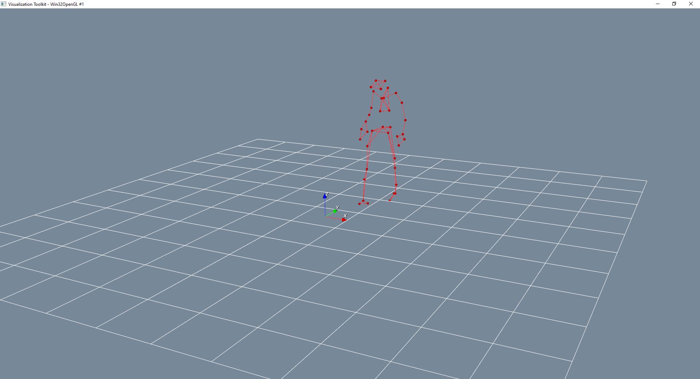

# PyMoCapViewer Documentation

PyMoCapViewer is a Python package designed to visualize motion capture data in a user-friendly and interactive manner. It allows you to load various mocap file formats, animate the skeleton, and control the viewing experience with keyboard shortcuts.

# Installation

You can install PyMoCapViewer using pip:

```bash
pip install PyMoCapViewer
```

# Keyboard Shortcuts
The following keyboard shortcuts are available for interacting with PyMoCapViewer:

| Key               | Action                     |
|-------------------|----------------------------|
| Space             | Play/pause animation       | 
| s                 | Capture screenshot         |
| Enter             | Capture Screenvideo        |
| i                 | Print current frame number |
| 0                 | Jump to first frame        |
| Left/Right Arrow  | Previous/Next frame        |
| Left Mouse Button | Interact with scene        |
| q                 | Quit application           |


# Example Usage

Load the kinematic data as a Pandas Dataframe. The columns should contain the joints in the following format: J1 (x), J1 (y), J1 (z), ..., JN (x), JN (y), JN (z).

```python
from PyMoCapViewer import MoCapViewer

import pandas as pd

df = pd.read_csv("file_to_vicon.csv")

render = MoCapViewer(sampling_frequency=100)
render.add_skeleton(df, skeleton_connection="vicon", color="gray")
render.show_window()
```
